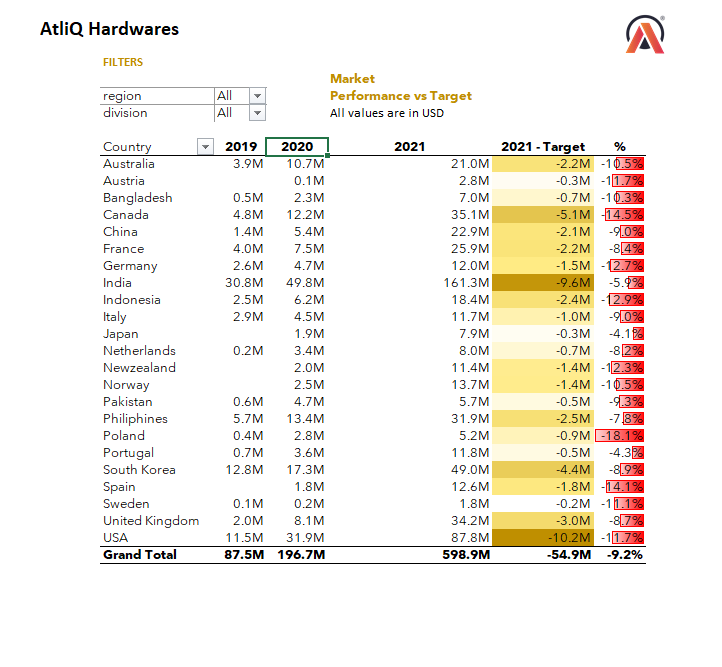
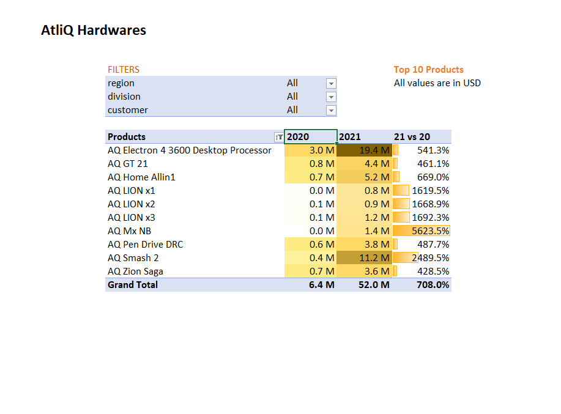
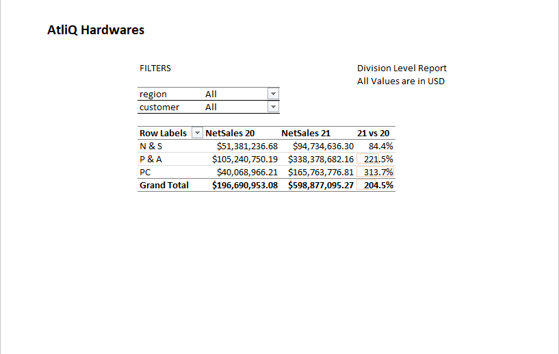
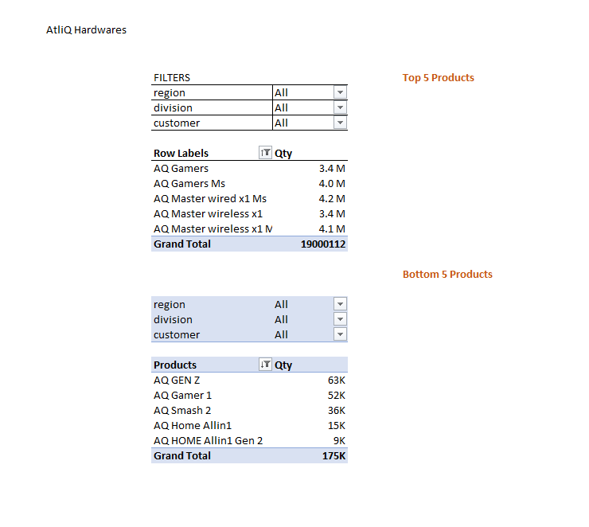
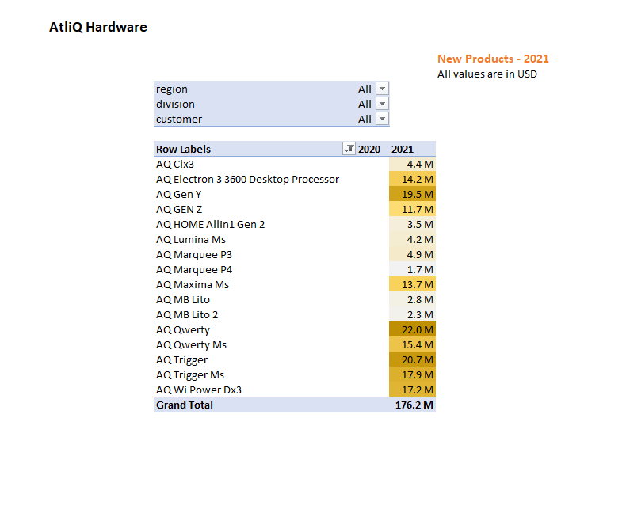
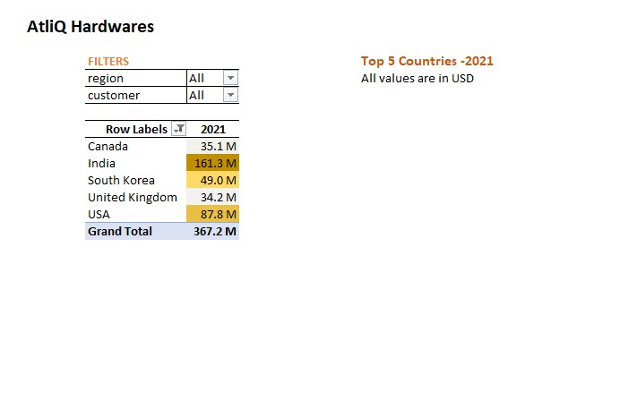

# AtliQ Hardware Sales Analysis – Excel

## 📊 Project Overview

This project analyzes AtliQ Hardware sales data using Microsoft Excel.

The analysis uses PivotTables, Power Pivot, the Excel Data Model, and DAX measures to generate business-focused sales reports and answer key business questions.

## 🛠️ Tools Used

- Microsoft Excel
- Power Pivot
- PivotTables
- Excel Data Model
- DAX
- Conditional Formatting

## 🎯 Business Questions

The project answers the following business questions:

1. What are the top 10 products based on the percentage increase in net sales from 2020 to 2021?
2. What is the net sales performance by division for 2020 and 2021?
3. Which products are in the top 5 and bottom 5 based on quantity sold?
4. What new products did AtliQ begin selling in 2021?
5. What are the top 5 countries based on net sales in 2021?

## 📈 Reports Created

### 1. Market Performance vs Target

Country-level sales performance compared with the 2021 target.

### 2. Top 10 Products

Top 10 products based on percentage increase in net sales from 2020 to 2021.

### 3. Division Level Report

Net sales comparison between 2020 and 2021 with growth percentage by division.

### 4. Top & Bottom 5 Products by Quantity

Products with the highest and lowest quantities sold.

### 5. New Products – 2021

Products that were newly introduced in 2021.

### 6. Top 5 Countries – 2021

Countries with the highest net sales in 2021.

## 🔍 Skills Demonstrated

- Data Analysis
- Data Modeling
- PivotTables
- Power Pivot
- DAX Measures
- Sales Analysis
- Percentage Growth Analysis
- Top/Bottom N Analysis
- Business Reporting
- Conditional Formatting

## 📁 Project Files

- `Atliq_Sales_Analysis.xlsx` – Complete Excel analysis workbook
- `screenshots/` – Screenshots of the completed reports

## 👨‍💻 Author

Ranuka Nethmina
